# Nombre del proyecto

## tarea-02

- **Josefa Araya**

- Asignatura: Dispositivos Periféricos y Plataformas para la Interacción Digital **DIS9087**

Proyecto de reconocimiento de gestos, utilizando Python y MediaPipe. Realizado tomando como referencia este repositorio:

- <https://github.com/catherpiee/meowmeowcatcam>

## Gestos

| # | *Nombre* | *Cómo se activa* | *imagen* |
| --- | --- | --- | --- |
| 1 | Default | cómo se activa | 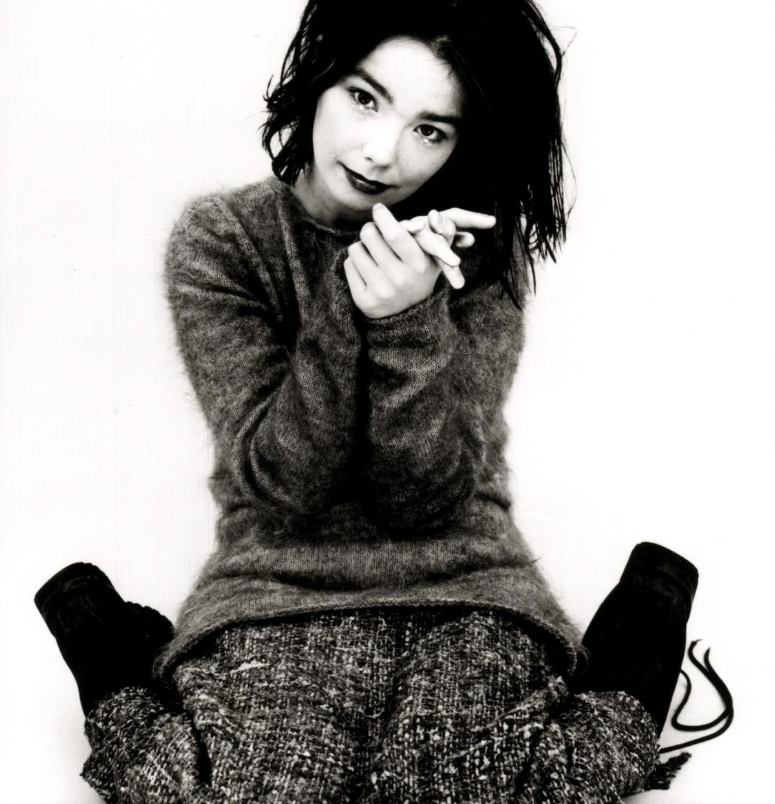 |
| 2 | Shhh | cómo se activa | 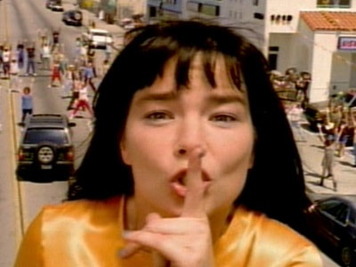 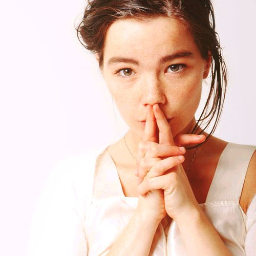 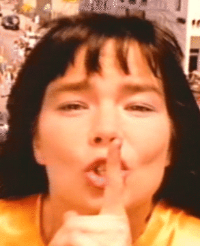 |
| 3 | middleFinger | cómo se activa | 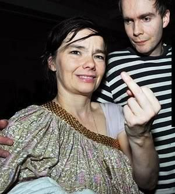 |
| 4 | sixSeven | cómo se activa | 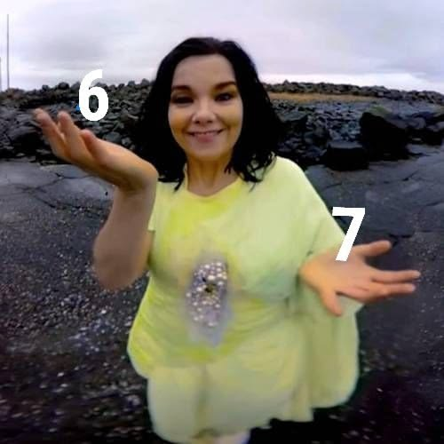 |
| 5 | debut | cómo se activa | 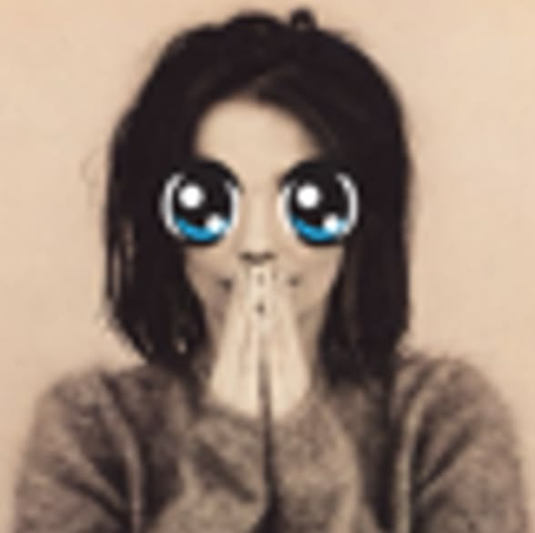 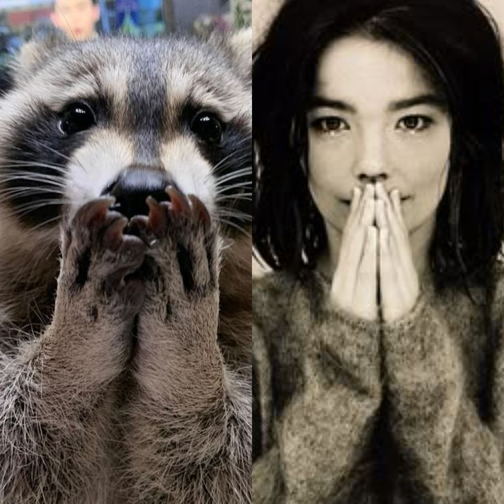  |
| 6 | sus | cómo se activa | 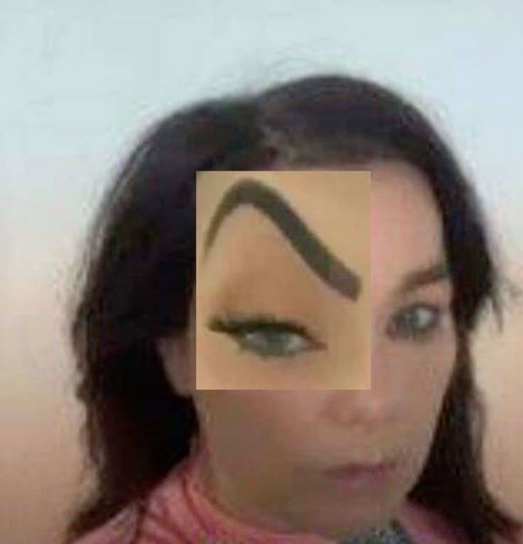 |
| 7 | kitty | cómo se activa | 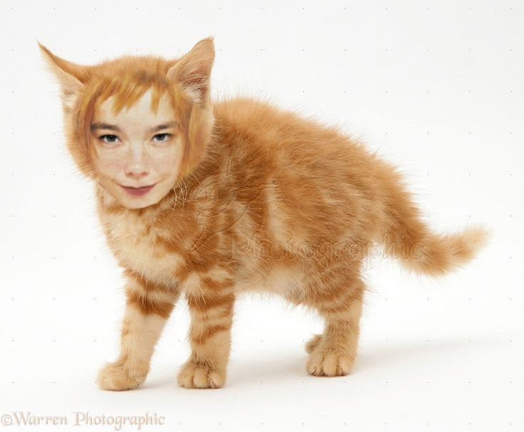 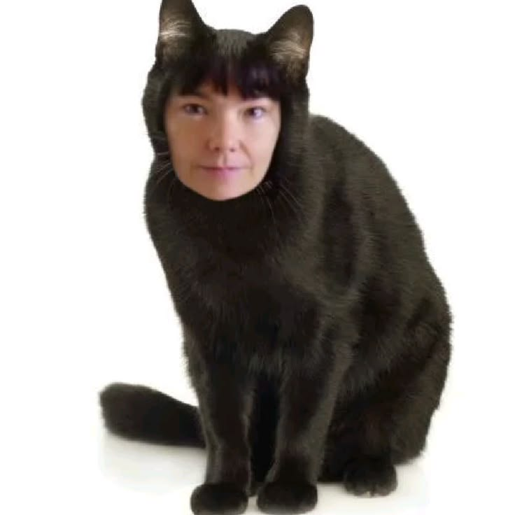 |
| 8 | rawr | cómo se activa | 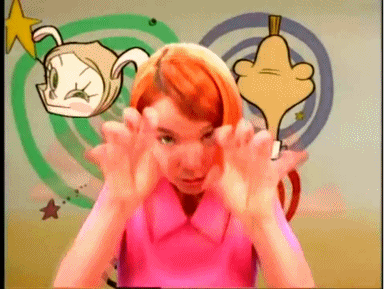 |
- [carpeta de imágenes](./bjorkReact)

- [video](./)
