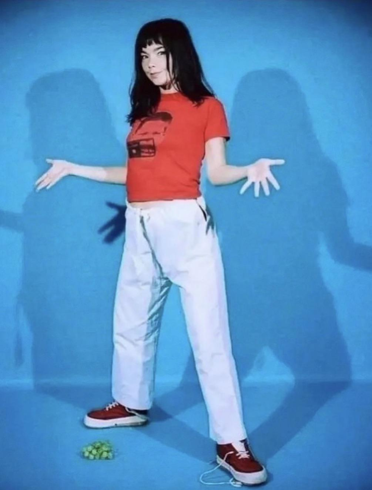
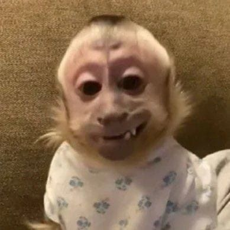
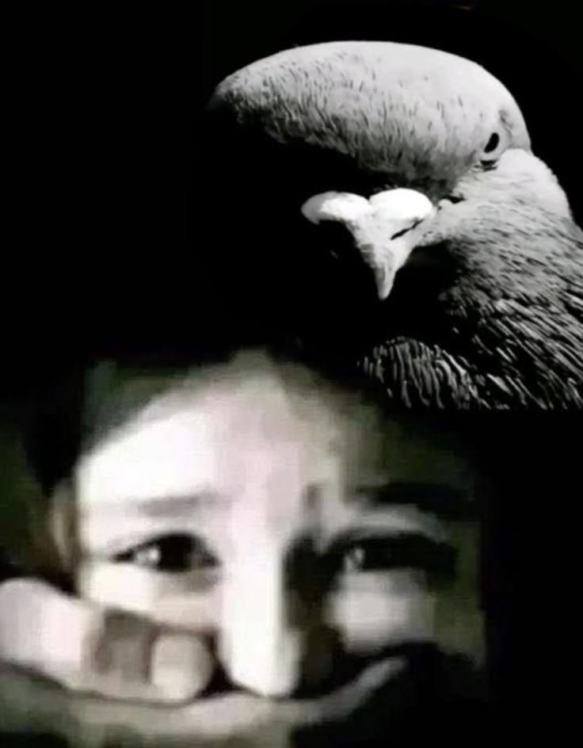
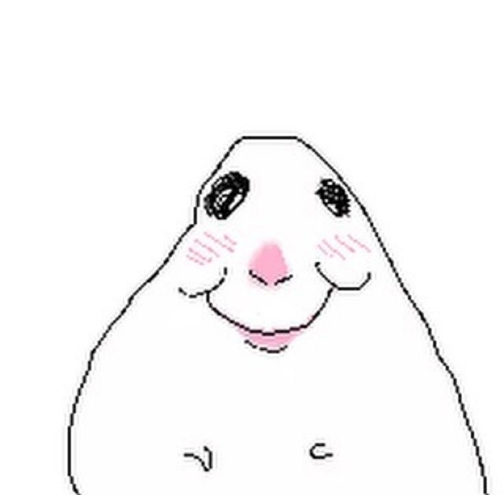
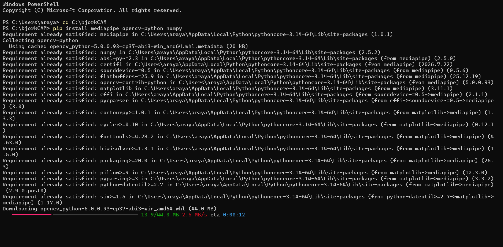

# Cámara detectora de gestos, versión Bjork.

- Asignatura: Dispositivos Periféricos y Plataformas para la Interacción Digital **DIS9087**

- **Josefa Araya**

## tarea-02
Proyecto de reconocimiento de gestos, utilizando Python y MediaPipe. Realizado tomando como referencia este repositorio:

- <https://github.com/catherpiee/meowmeowcatcam>

## Gestos

| # | *Nombre* | *Cómo se activa* | *imagen* |
| --- | --- | --- | --- |
| 0 | default | Sin gesto |  |
| 1 | huh | Manos abiertas al lado del torso |  |
| 2 | Shhh | Dedo índice por encima de la boca + ojos medio cerraods |    (gif solo en la versión web) |
| 3 | middleFinger | Dedo del medio levantado |  |
| 4 | sixSeven | Alternar las manos arriba y abajo |  |
| 5 | debut | Manos juntas como rezando por encima de la boca |    |
| 6 | sus | Ceja izquierda levantada + cabeza girada para la derecha |  |
| 7 | kitty | Manos empuñadas a bajo del mentón |   |
| 8 | rawr (solo en la versión web) | Abrir las manos y cerrarlas repetidamente |  |

## Proceso

Lo primero que hice fue correr el código original de <https://github.com/catherpiee> en la web y leer los códigos de su repositorio para entender
un poco cómo funcionaba. 
También visité y leí las webs y documentaciones linkeadas al final para tener un poco de conocimiento sobre como funcionaban los landmarks de MediaPipe.
Luego lo más difícil fue elegir la temática, tenía las siguientes opciones: 

Al final me decidí por imagenes de Börjk ya que encontré una mayor variedad de gestos interpretables.

Con ayuda de Claude AI en base al ejercicio de los gatos lo modifiqé con los gestos y fotos seleccionadas, tuve algunos problemas 
de sintaxis pero con el debugger de Visual Studio Code y Claude lo pude solucionar. 

Lo más entretenido para mi fue correrlo en el computador con Python ya que eran más pasos en el Power Shell que nunca habia usado antes 
de este proyecto.

- [carpeta de imágenes](./bjorkReact)

- [Drive con demostraciones](https://drive.google.com/drive/folders/1GvrCgCUgi4XdelVKwA5rIjgiQ0RIMXah?usp=sharing)

#### Links visitados
- <https://developers.google.com/edge/mediapipe/solutions/vision/hand_landmarker/python>
- <https://www.kaggle.com/datasets/psewmuthu/optimized-video-facial-landmarks/data>
- <https://mediapipe.readthedocs.io/en/latest/solutions/face_mesh.html>
- <https://github.com/google-ai-edge/mediapipe/blob/master/mediapipe/modules/face_geometry/effect_renderer_calculator.cc>
- <https://hackernoon.com/mediapipe-face-mesh-landmark-indices-cheat-sheet>
- <https://mediapipe.readthedocs.io/en/latest/solutions/hands.html>
- <https://www.sanderdesnaijer.com/projects/eyebrow-tetris?ref=hackernoon.com>
- <https://www.sanderdesnaijer.com/blog/mediapipe-face-mesh-landmarks>
